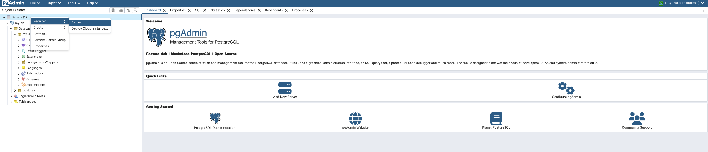
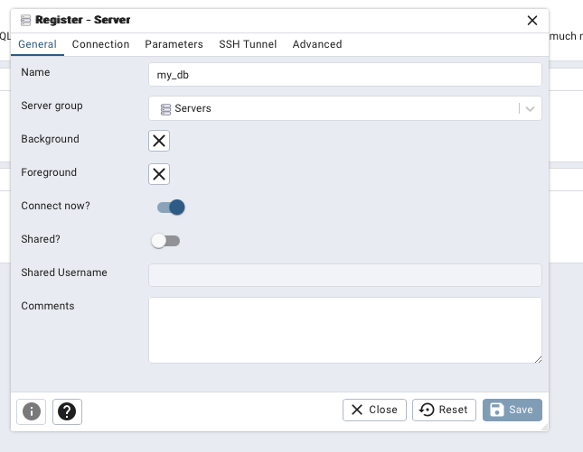
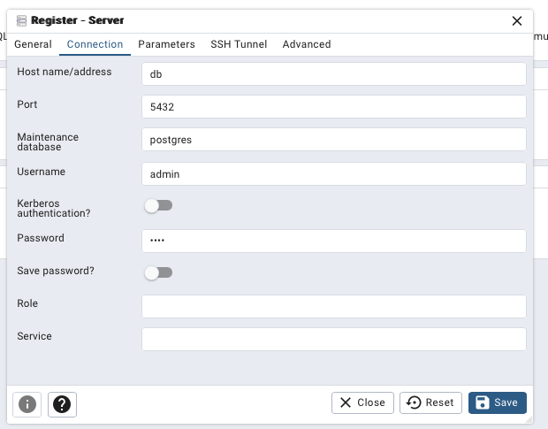

Перед запуском программы необходимо поднять контейнер с базой данных и утилитой PGadmin.

```
docker-compose up
```

Далее необходимо установить в виртуальное окружение все зависимости из файла requirements.txt

```
pip install -r requirements.txt
```

Переходим в директорирю workshop

```
cd workshop
```

Выполняем миграции

```
python manage.py makemigrations
python manage.py migrate
```

Запускаем приложение

```
python manage.py runserver
```

Для доступа к утилите pgadmin необходимо перейти по localhost с портом 5050 (указан в конфигурации docker-compose.yml)

Для входа необходимо ввести почту и пароль, указанные в конфигурации docker-compose.yml

Чтобы БД отобразилась в pgadmin необходимо подключится к ней:







